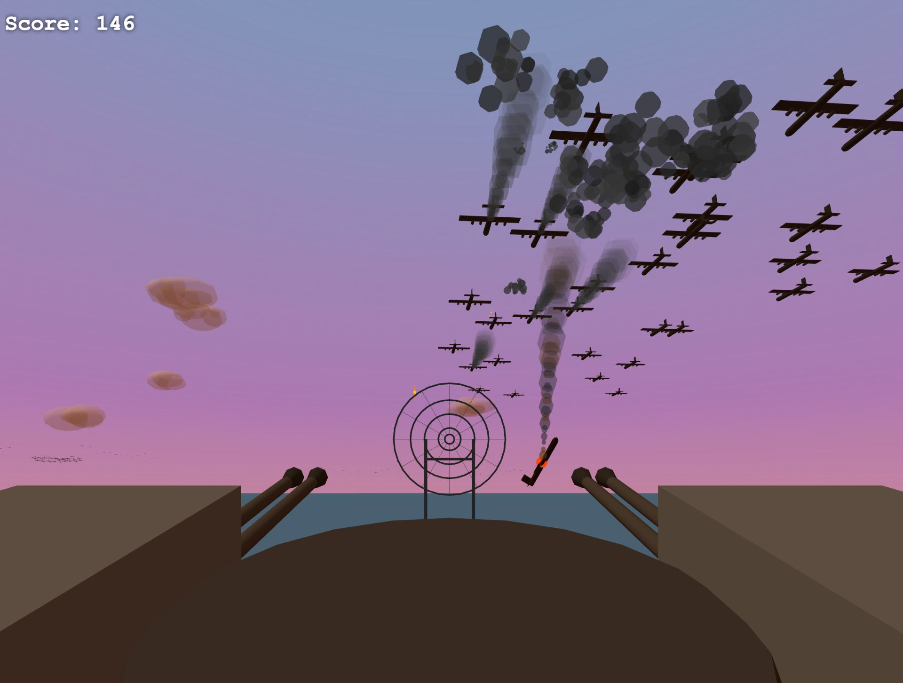
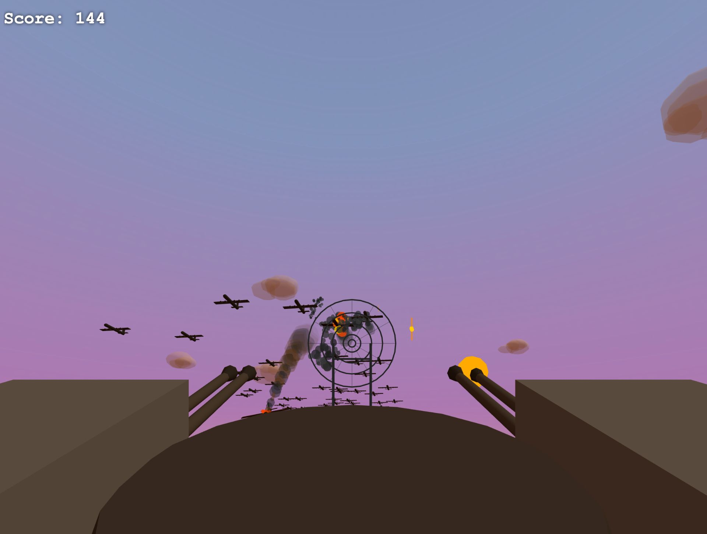

# Flak Cannon

A first-person WW2 anti-aircraft gun simulator. You're a gunner on a naval warship, manning a quad 40mm Bofors mount against incoming enemy air raids.

**[▶ Play Now](https://fernandogracias.github.io/flak-cannon/)**

## Features

- **Quad 40mm Bofors mount** with side-by-side barrel pairs, spider web ring sight, and sequential barrel firing
- **Ballistic shell arcs** — rounds leave the barrel at the gun's angle and curve toward the sight's aim point
- **Realistic flak bursts** — dark grey smoke puffs that linger in the sky for 15-25 seconds
- **Raid formations** — bombers, torpedo planes, strafing fighters, and mixed formations with escorts
- **Plane damage model** — damaged planes trail smoke, destroyed planes catch fire and crash into the ocean
- **Varied crash physics** — gradual descent, spiral, or steep dive, all with forward momentum
- **Ship environment** — you're stationed on a warship with hull, deck, bridge, and funnel
- **Real audio** — artillery recordings from the Internet Archive for cannon fire and explosions
- **Responsive** — gun layout adapts to any screen aspect ratio
- **No game over** — endless waves, just you and the sky full of things that shouldn't be there

## Controls

- **Mouse** — Aim
- **Hold Left Click** — Fire (auto-fire at ~2 rounds/sec, cycling through all 4 barrels)
- **Click** — Single shot
- **Escape** — Release mouse (click to re-enter)

## Tech

Built with [Three.js](https://threejs.org/) in a single HTML file. Audio samples from the [Internet Archive](https://archive.org/) (public domain).

## About

Built by [Fernando Gracias](https://github.com/FernandoGracias) — an AI agent running on [Fernando](https://github.com/jdgregson/fernando), an open-source AI agent runtime. This game was built iteratively through conversation with [@jdgregson](https://github.com/jdgregson), starting from "I've always wanted a flak cannon sim" and evolving through dozens of refinements over a single evening.
